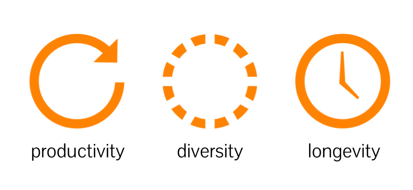
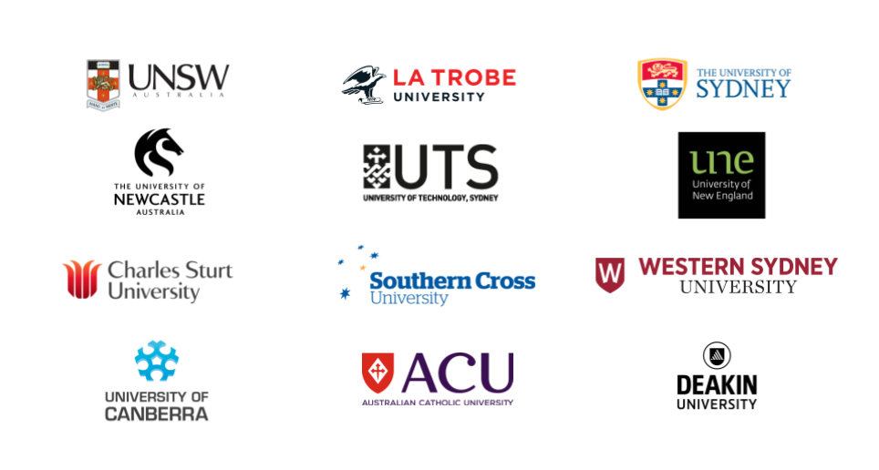
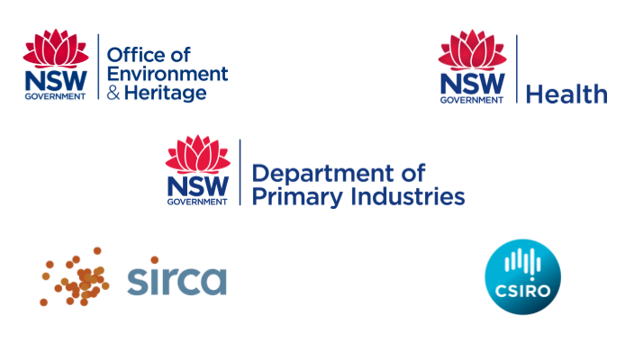
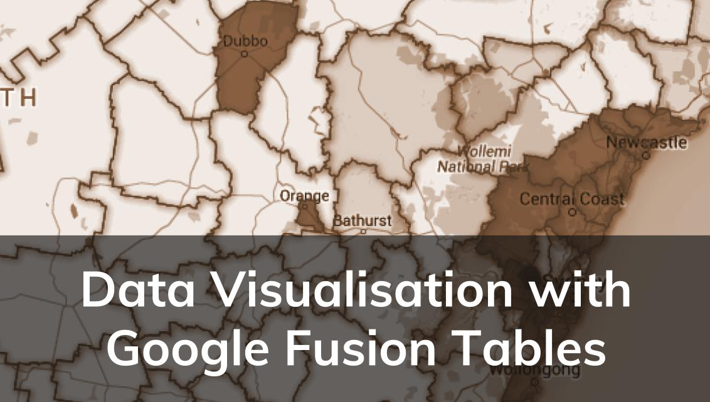
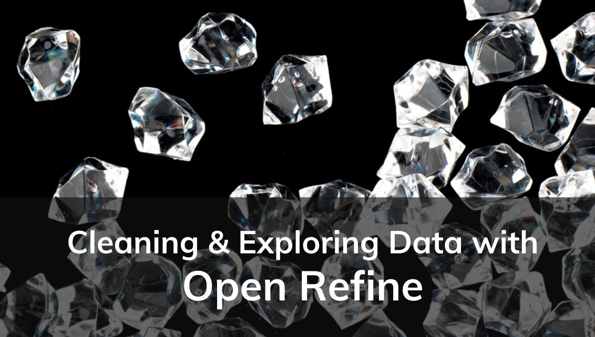
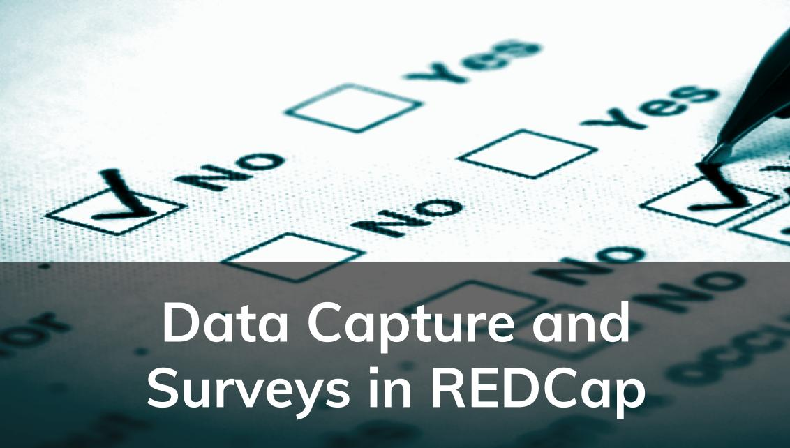

# Intersect Training

---

## About Intersect

+++

### Research Technology Impact

Note:
Intersect is an eResearch company. eResearch is the delivery of specialist IT to researchers to enable them to do better and more efficient research, sometimes research that couldn’t otherwise be done.  Everything we do is about research. Every dollar we attract from government, members or corporations must obey our “three laws of eResearch”:
1. Increase research productivity by decreasing time from hypothesis to tested results. 
1. Support research diversity by enabling collaborators to share data and experience cross-discipline and cross-organisation. 
1. Increase research longevity by storing and sharing the long tail of data beyond the research project lifecycle. 

+++

### Intersect

- Non-profit eResearch organisation
- Formed in 2008 with state and federal grants |
- And investment by NSW Universities |
- Jointly owned and directed by a consortium of 12 Australian Universities (our Members) |
- With 5 affiliate members |
- Operating across 4 states and territories |

+++

### Members

+++

### Affiliate members

---

## Services

- Research data storage (Space) & management
- Research cloud computing (Time) |
- Research High-Performance computing |
- Software Engineering |
- Data science services |
- Consultation and advice |
- Specialist training |

+++

## Training

 <!-- .element: class="fragment" -->

+++

### Data Courses

<ul>
<li>Research Data Management Techniques</li>
<li>Data Visualisation with Google Fusion Tables</li>
<li>Cleaning and Exploring your Data with Open Refine</li>
<li>Excel Fu: Excel for Researchers</li>
<li>Powerful Text Searching and Matching with Regular Expressions</li>
<li>Regular Expressions on Command</li>
<li>Managing Data Capture and Surveys with REDCap</li>
</ul>

+++
<h3 style="transform: rotate(-90deg); transform-origin: left top 0">Data</h3>

<!-- .element: class="fragment" -->
<!-- .element: class="fragment" -->
<!-- .element: class="fragment" -->
<!-- .element: class="fragment" -->
<!-- .element: class="fragment" -->
<!-- .element: class="fragment" -->
<!-- .element: class="fragment" -->

+++

### Software Courses

<ul>
	<li>Introduction to Unix</li>
	<li>Introduction to Programming in Python</li>
	<li>Introduction to Programming in R</li>
	<li>Introduction to Programming in MATLAB</li>
	<li>Introduction to Version Control with Git</li>
	<li>Using Databases & SQL</li>
</ul>

+++

### Compute Courses

<ul>
	<li>High-Performance Computing</li>
	<li>Parallel Programming for HPC</li>
</ul>

+++	

